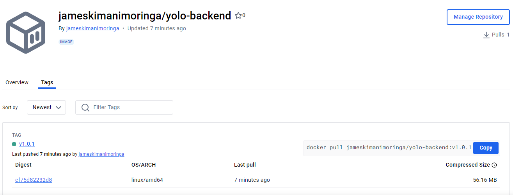

## 1. Choice of Base Image
 **Client/Front-End Base Image Choice**
 The client image created by a multi-stage build dockerfile that uses two base images:
 1. `node:20.18.0-alpine` 
    - selected for the build stage mainly because it has node and npm, which are required to build the app. The image is based on Alpine Linux distribution, making it lightweight.

 2. `nginx:1.16.0-alpine` 
    - selected for the final build stage mainly because it has NGINX, which is a webserver capable of serving the final built frontend app. The image is based on Alpine Linux distribution, making it lightweight.

The multi-stage build reduced the final image size from ~400MB to ~23MB.🎉🎉

 **Back-End Base Image Choice**
 1. `node:20.18.0-alpine` 
    - selected for the build stage mainly because it has node and npm, which are required to build and run the app. The image is based on Alpine Linux distribution, making it lightweight.

 **MongoDB Database Image Choice**
 1. `mongo:8.0.1-noble` 
    - Selected because it was the smallest fully featured MongoDB image.
       

## 2. Dockerfile directives used in the creation and running of each container.
 I used two Dockerfiles. One for the Client and the other one for the Backend.

**Client Dockerfile**

```
# build environment
FROM node:20.18.0-alpine as build
WORKDIR /app

#add node_modules folder to $PATH variable
ENV PATH /app/node_modules/.bin:$PATH

# Copy the package.json and package-lock.json files to the image
COPY package*.json ./

#install frontend  dependancies
RUN npm install

#copy application code into image
COPY . /app

#build production app
RUN npm run build

#STAGE 2: production environment
FROM nginx:1.16.0-alpine

#copy built application to the prod. image and into nginx public web root folder
COPY --from=build /app/build /usr/share/nginx/html
EXPOSE 80
CMD ["nginx", "-g", "daemon off;"]

```
**Backend Dockerfile**

```
FROM node:20.18.0-alpine

#Base image comes with non-root user "node".
#app and app/node_modules directory created and ownership assiged to the node user
RUN mkdir -p /home/node/app/node_modules && chown -R node:node /home/node/app

#set the app directory in the node user home dir as the working directory
WORKDIR /home/node/app

# Copy the package.json and package-lock.json files to the container & Assign node user ownership
COPY --chown=node:node package*.json ./

#Non root user "node" used as security best practice
USER node

#install backend dependancies
RUN npm install

#copy application code with the appropriate permissions into the container's app directory
COPY --chown=node:node . .

# Expose the port the app runs on
EXPOSE 5000

# Define the command to run the app
CMD [ "node", "server.js" ]

```

## 3. Docker Compose Networking
The (docker-compose.yml) defines the networking configuration for the project. It includes the allocation of application ports. The relevant sections are as follows:


```
version: 1.0.1

services: 
  frontend:
    #...
    image: yolo-frontend:V1.0.1
    ports: 
      - "3000:80"
    networks: 
      - app-network

  backend:
    image: yolo-backend:V1.0.1 
    #...
    ports:
      - "5000:5000"
    networks:
      - app-network

  mongo:
    image: mongo:8.0.1-noble
    container_name: yolo-mongodb
    #...
    ports:
      - "27017:27017"
    networks:
      - app-network
  
#...
networks:
  app-network:
    driver: bridge
```
In this configuration, the backend container is mapped to port 5000 of the host, the client container is mapped to port 3000 of the host, forwarded from port 80 used by nginx to serve the frontend in the container. Mongodb container is mapped to port 27017 of the host. All containers are connected to the app-network bridge network.


## 4.  Docker Compose Volume Definition and Usage
The Docker Compose file includes volume definitions persisting data for the backend, frontend client and the database. The relevant section is as follows:

```
services: 
  frontend:
    image: yolo-frontend:V1.0.1
    #...
    volumes:
      - app_data:/home/node/frontend
  backend:
    #...
    image: yolo-backend:V1.0.1 
    #...
    volumes:
      - app_data:/home/node/app
     
  mongo:
    image: mongo:8.0.1-noble
    container_name: yolo-mongodb
    #...
    volumes:  
      - db_data:/data/db  
    #...
volumes:
  app_data:        # shared volume for both backend and frontend 
  db_data:         # Dedicated volume for MongoDB data

```
This volume, mongodb_data, is designated for storing MongoDB data. It ensures that the data remains intact and is not lost even if the container is stopped or deleted.

## 5. Git Workflow to achieve the task

I used the git feature branch workflow to achieve the task.(more info: https://www.atlassian.com/git/tutorials/comparing-workflows/feature-branch-workflow). This involved:

1. forking the orginal repository
2. cloning the repository to my local machine
3. creating a feature branch called ```devops-ips-02```
4. making commits to that branch with every task I completed
5. when the assignement was done, I merged the ```devops-ips-02``` to the ```master``` branch

## 6. Screenshot of your deployed image on DockerHub
Below are the screenshots of the two images deployed to Dockerhub (backend and client images). The screenshot also shows image naming conventions used.

**Client/Frontend Image on Dockerhub**


**backend Image on Dockerhub**
